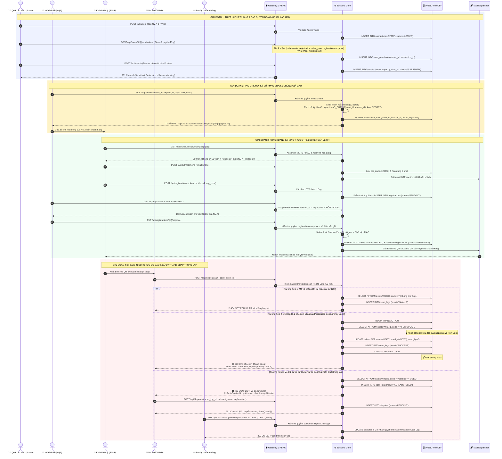
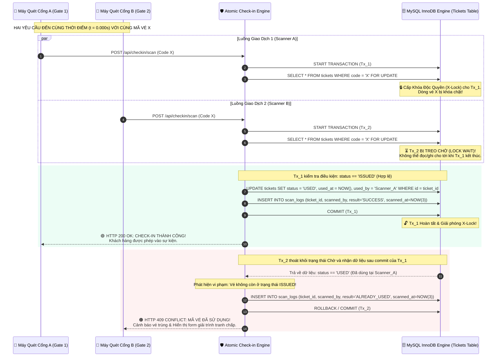
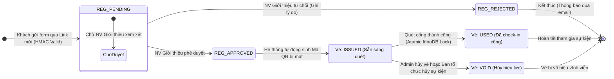
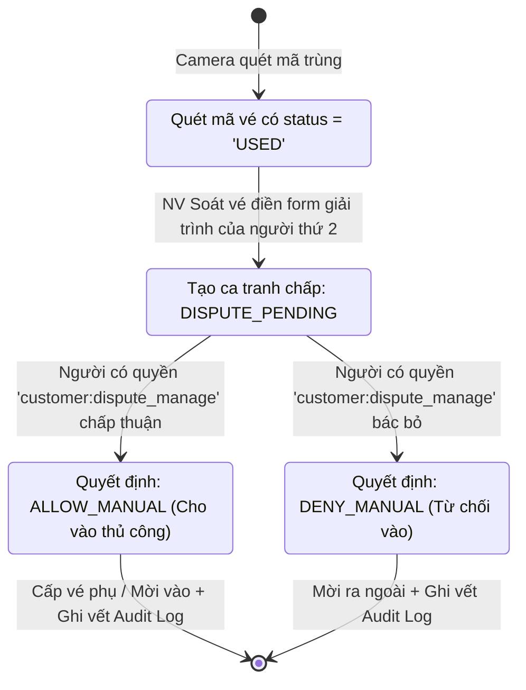
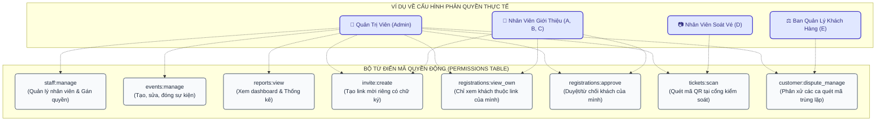
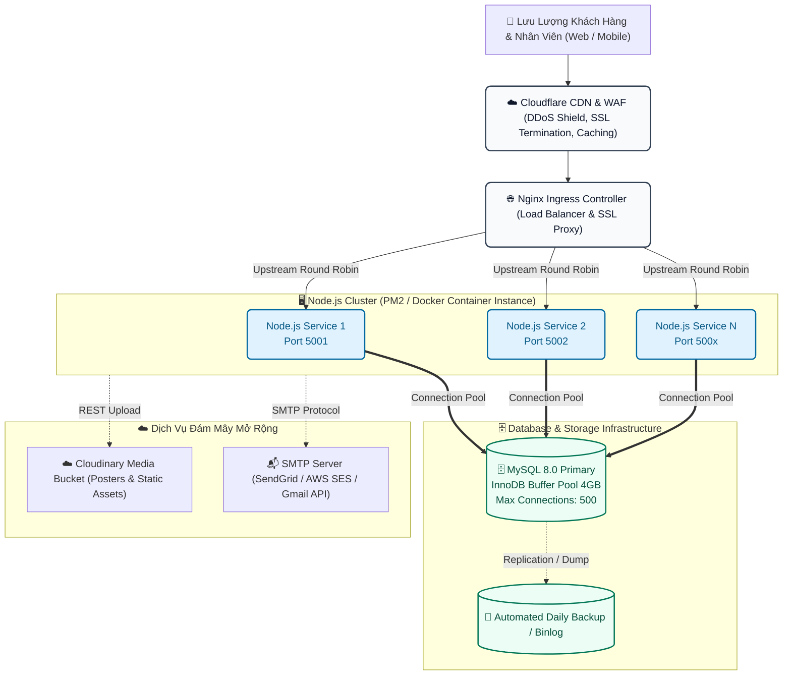

# KIẾN TRÚC HỆ THỐNG QUẢN LÝ SỰ KIỆN & PHÁT HÀNH / CHECK-IN VÉ QR CODE
> **Enterprise Architectural Blueprint & System Diagrams**  
> **Phiên bản:** 3.0 (Enterprise Production Standard)  
> **Tiêu chuẩn thiết kế:** Modular Monolith Layered Architecture, ACID Concurrency Control, Zero-PII Security Model, Granular RBAC Engine.

---

## MỤC LỤC TÀI LIỆU
1. [Sơ đồ Kiến trúc Đa tầng Tổng thể (Enterprise Architecture & C4 Container View)](#1-sơ-đồ-kiến-trúc-đa-tầng-tổng-thể)
2. [Sơ đồ Thực thể Dữ liệu Chuẩn hóa (Enterprise ERD - 3NF Data Model)](#2-sơ-đồ-thực-thể-dữ-liệu-chuẩn-hóa)
3. [Sơ đồ Tuần tự Nghiệp vụ Toàn diện (End-to-End Business Flow)](#3-sơ-đồ-tuần-tự-nghiệp-vụ-toàn-diện)
4. [Sơ đồ Cơ chế Xử lý Race Condition & Check-in Atomic (Concurrency Engine)](#4-cơ-chế-xử-lý-race-condition--check-in-atomic)
5. [Sơ đồ Chuyển đổi Trạng thái Thực thể (Finite State Machine Diagrams)](#5-sơ-đồ-chuyển-đổi-trạng-thái-thực-thể)
6. [Sơ đồ Kiến trúc Bảo mật & Mã hóa QR Zero-PII (Security & Cryptography)](#6-kiến-trúc-bảo-mật--mã-hóa-qr-zero-pii)
7. [Ma trận Phân quyền Động (Granular Dynamic RBAC Matrix)](#7-ma-trận-phân-quyền-động)
8. [Sơ đồ Hạ tầng Triển khai & Vận hành (Production Deployment Topology)](#8-sơ-đồ-hạ-tầng-triển-khai--vận-hành)

---

## 1. SƠ ĐỒ KIẾN TRÚC ĐA TẦNG TỔNG THỂ
*(Enterprise Architecture & C4 Container View)*

Hệ thống được tổ chức theo mô hình **Modular Layered Architecture (Kiến trúc phân tầng mô-đun hóa)**, phân tách rạch ròi giữa giao diện người dùng, lớp cổng bảo mật (Edge & Gateway), lõi ứng dụng nghiệp vụ (Application Core), hàng đợi xử lý nền (Async Workers) và lớp dữ liệu bền vững (Persistence Layer).

```mermaid
flowchart TD
    %% ========================================================
    %% STYLE DEFINITIONS
    %% ========================================================
    classDef clientStyle fill:#e0f2fe,stroke:#0284c7,stroke-width:2px,color:#0369a1,rx:8,ry:8;
    classDef edgeStyle fill:#fef3c7,stroke:#d97706,stroke-width:2px,color:#b45309,rx:8,ry:8;
    classDef coreStyle fill:#ede9fe,stroke:#7c3aed,stroke-width:2px,color:#5b21b6,rx:8,ry:8;
    classDef modStyle fill:#ffffff,stroke:#8b5cf6,stroke-width:1.5px,color:#4c1d95,rx:6,ry:6;
    classDef asyncStyle fill:#fce7f3,stroke:#db2777,stroke-width:2px,color:#9d174d,rx:8,ry:8;
    classDef dataStyle fill:#ecfdf5,stroke:#059669,stroke-width:2px,color:#065f46,rx:8,ry:8;
    classDef extStyle fill:#f1f5f9,stroke:#64748b,stroke-width:2px,color:#334155,rx:8,ry:8;

    %% ========================================================
    %% 1. CLIENT TIER
    %% ========================================================
    subgraph TIER_CLIENT["🌐 1. PRESENTATION & CLIENT TIER (Vue 3 + Vite + Tailwind)"]
        direction LR
        UI_Admin["🖥️ Admin Portal<br/><b>Quản trị Hệ thống</b><br/>• Quản lý NV & Cấp quyền<br/>• Quản trị Sự kiện & Báo cáo"]:::clientStyle
        UI_Referral["📱 Referrer Portal<br/><b>NV Giới thiệu (A, B, C)</b><br/>• Tạo link mời HMAC<br/>• Xem & Duyệt vé khách riêng"]:::clientStyle
        UI_Scanner["📷 Check-in Portal<br/><b>NV Soát vé Cổng (D)</b><br/>• Camera HTML5-QRCode<br/>• Âm thanh/Rung phản hồi"]:::clientStyle
        UI_Customer["🎫 Customer Portal<br/><b>Khách tham dự</b><br/>• RSVP Landing & OTP<br/>• Nhận & Xem vé QR"]:::clientStyle
    end

    %% ========================================================
    %% 2. EDGE GATEWAY & SECURITY TIER
    %% ========================================================
    subgraph TIER_GATEWAY["🛡️ 2. EDGE GATEWAY & SECURITY SHIELD (Reverse Proxy / WAF)"]
        direction TB
        GW_SSL["🔒 Nginx / Cloudflare Edge (SSL/TLS 1.3 Termination, HTTP/2, DDoS Protection)"]:::edgeStyle
        GW_WAF["🛡️ WAF & Security Middleware (Helmet Headers, CORS Whitelist, XSS/SQLi Filtering)"]:::edgeStyle
        GW_RateLimit["⏱️ Rate Limiter Guard (Quét QR: 60 rpm | OTP: 3 req/5min | Register: 10 rpm)"]:::edgeStyle
        GW_Auth["🔑 JWT Authenticator & Stateless Token Validator (Bearer Token, Expiry & Signature)"]:::edgeStyle
        GW_RBAC["⚖️ Dynamic RBAC Guard (Permission-based Middleware: Kiểm tra quyền động theo user_id)"]:::edgeStyle
    end

    %% ========================================================
    %% 3. APPLICATION CORE TIER
    %% ========================================================
    subgraph TIER_APP["⚙️ 3. APPLICATION LOGIC CORE (Node.js + Express + TypeScript)"]
        direction TB
        subgraph MOD_AUTH_IAM["Domain: IAM & Authorization"]
            M_Auth["🔐 Auth & OTP Module<br/>(Bcrypt, TOTP, Email Token)"]:::modStyle
            M_User["👥 User & RBAC Engine<br/>(Dynamic Permission Grants)"]:::modStyle
        end

        subgraph MOD_EVENT_INVITE["Domain: Event & Invite Management"]
            M_Event["📅 Event Catalog Engine<br/>(Metadata, Media, Capacity)"]:::modStyle
            M_Invite["🔗 Tamper-proof Invite Engine<br/>(HMAC-SHA256 Token Signer)"]:::modStyle
        end

        subgraph MOD_TICKET_CHECKIN["Domain: Registration, Ticket & Scanning"]
            M_Reg["📝 Registration Workflow<br/>(Anti-duplicate, Approval State)"]:::modStyle
            M_Ticket["🎟️ Cryptographic Ticket Engine<br/>(Zero-PII Opaque Hash QR)"]:::modStyle
            M_AtomicCheckin["⚡ Atomic Check-in Engine<br/>(Pessimistic Row Lock: FOR UPDATE)"]:::modStyle
            M_Dispute["⚖️ Dispute Arbitration Engine<br/>(Quản lý Vé trùng & Audit Log)"]:::modStyle
        end
    end

    %% ========================================================
    %% 4. ASYNC WORKERS & QUEUES
    %% ========================================================
    subgraph TIER_ASYNC["⚡ 4. ASYNCHRONOUS PROCESSING & WORKERS"]
        direction LR
        W_Mailer["📬 Async Email Dispatcher<br/>(Gửi OTP, Vé QR & Thư mời)"]:::asyncStyle
        W_Media["☁️ Cloud Media Pipeline<br/>(Upload & Tối ưu ảnh Poster)"]:::asyncStyle
        W_Audit["📜 Immutable Audit Logger<br/>(Lưu vết Scan & Thao tác quản trị)"]:::asyncStyle
    end

    %% ========================================================
    %% 5. PERSISTENCE & STORAGE TIER
    %% ========================================================
    subgraph TIER_DATA["🗄️ 5. DATA PERSISTENCE & STORAGE TIER"]
        direction LR
        DB_Master[("🗄️ MySQL 8.0 Primary (InnoDB)<br/>• ACID Transactions<br/>• Row-Level Lock FOR UPDATE<br/>• Strict Unique & FK Constraints")]:::dataStyle
        STORAGE_Cloudinary["☁️ Cloudinary CDN<br/>• Event Posters<br/>• QR Images"]:::extStyle
        SMTP_Server["✉️ SMTP Relay Server<br/>(Gmail SMTP / SendGrid / SES)"]:::extStyle
    end

    %% ========================================================
    %% CONNECTIVITY & DATA FLOW
    %% ========================================================
    UI_Admin -->|"HTTPS / REST"| GW_SSL
    UI_Referral -->|"HTTPS / REST"| GW_SSL
    UI_Scanner -->|"HTTPS / REST (Fast Scan)"| GW_SSL
    UI_Customer -->|"HTTPS / REST"| GW_SSL

    GW_SSL --> GW_WAF --> GW_RateLimit --> GW_Auth --> GW_RBAC

    GW_RBAC -->|"Dispatched Request"| M_Auth
    GW_RBAC -->|"Dispatched Request"| M_User
    GW_RBAC -->|"Dispatched Request"| M_Event
    GW_RBAC -->|"Dispatched Request"| M_Invite
    GW_RBAC -->|"Dispatched Request"| M_Reg
    GW_RBAC -->|"Dispatched Request"| M_Ticket
    GW_RBAC -->|"Dispatched Request"| M_AtomicCheckin
    GW_RBAC -->|"Dispatched Request"| M_Dispute

    M_Event -.->|"Job"| W_Media
    M_Auth -.->|"Job"| W_Mailer
    M_Ticket -.->|"Job"| W_Mailer
    M_AtomicCheckin -.->|"Audit Event"| W_Audit

    W_Media --> STORAGE_Cloudinary
    W_Mailer --> SMTP_Server
    W_Audit --> DB_Master

    M_Auth ==>|"Connection Pool"| DB_Master
    M_User ==>|"Connection Pool"| DB_Master
    M_Event ==>|"Connection Pool"| DB_Master
    M_Invite ==>|"Connection Pool"| DB_Master
    M_Reg ==>|"Connection Pool"| DB_Master
    M_Ticket ==>|"Connection Pool"| DB_Master
    M_AtomicCheckin ==>|"TRANSACTION (FOR UPDATE)"| DB_Master
    M_Dispute ==>|"Connection Pool"| DB_Master
```



---

## 2. SƠ ĐỒ THỰC THỂ DỮ LIỆU CHUẨN HÓA
*(Enterprise ERD - 3NF Data Model)*

Mô hình dữ liệu được thiết kế đạt **Chuẩn hóa bậc 3 (3NF)**, đầy đủ khóa chính (`PK`), khóa ngoại (`FK`), ràng buộc duy nhất (`UK`), và hệ thống Index tối ưu cho việc truy vấn vé dưới 5 mili-giây.

```mermaid
erDiagram
    %% IAM & RBAC Relationships
    USERS ||--o{ USER_PERMISSIONS : "assigned"
    PERMISSIONS ||--o{ USER_PERMISSIONS : "granted via"
    
    %% Event & Invite Relationships
    USERS ||--o{ EVENTS : "creates (Admin)"
    EVENTS ||--o{ INVITE_LINKS : "contains"
    USERS ||--o{ INVITE_LINKS : "issues (Referrer)"

    %% Registration & Ticket Relationships
    EVENTS ||--o{ REGISTRATIONS : "receives"
    USERS ||--o{ REGISTRATIONS : "submits (Customer)"
    INVITE_LINKS ||--o{ REGISTRATIONS : "attributed to"
    USERS ||--o{ REGISTRATIONS : "approves (Referrer)"
    REGISTRATIONS ||--|| TICKETS : "generates (1-1)"
    EVENTS ||--o{ TICKETS : "valid in"

    %% Scanning & Dispute Relationships
    TICKETS ||--o{ SCAN_LOGS : "scanned history"
    USERS ||--o{ SCAN_LOGS : "scanned by (Staff)"
    SCAN_LOGS ||--o| DISPUTES : "escalates to (1-0..1)"
    USERS ||--o{ DISPUTES : "resolved by (Manager)"

    %% ==========================================
    %% ENTITY DEFINITIONS
    %% ==========================================

    USERS {
        int id PK "Tự tăng, Khóa chính"
        enum type "ADMIN | STAFF | CUSTOMER"
        varchar name "Họ và tên hiển thị"
        varchar phone UK "SĐT đăng nhập (Duy nhất)"
        varchar email UK "Email nhận thông báo/vé (Duy nhất)"
        varchar password_hash "Mã băm bcrypt ($2b$10$...)"
        varchar otp_code "Mã xác thực OTP (6 ký số)"
        datetime otp_expires_at "Hạn hiệu lực của OTP"
        enum status "ACTIVE | BLOCKED"
        datetime created_at "Thời điểm tạo tài khoản"
        datetime updated_at "Thời điểm cập nhật cuối"
    }

    PERMISSIONS {
        int id PK "Khóa chính"
        varchar code UK "Mã định danh quyền (vd: tickets:scan)"
        varchar name "Tên quyền hiển thị thân thiện"
        text description "Mô tả chi tiết phạm vi quyền"
        datetime created_at "Thời điểm khởi tạo"
    }

    USER_PERMISSIONS {
        int id PK "Khóa chính"
        int user_id FK "Liên kết users.id"
        int permission_id FK "Liên kết permissions.id"
        datetime created_at "Thời điểm cấp quyền"
    }

    EVENTS {
        int id PK "Khóa chính sự kiện"
        varchar name "Tên sự kiện"
        text description "Nội dung chi tiết chương trình"
        varchar location "Địa điểm tổ chức"
        varchar poster_url "URL ảnh poster trên Cloudinary"
        varchar video_url "URL video trailer/teaser"
        datetime start_at "Thời điểm khai mạc"
        datetime end_at "Thời điểm bế mạc"
        int capacity "Sức chứa tối đa (Khách)"
        enum status "DRAFT | PUBLISHED | CLOSED | CANCELLED"
        int created_by FK "Liên kết users.id (Admin tạo)"
        datetime created_at
        datetime updated_at
    }

    INVITE_LINKS {
        int id PK "Khóa chính"
        int event_id FK "Liên kết events.id"
        int referrer_id FK "Liên kết users.id (NV Giới thiệu)"
        varchar token UK "Token bí mật ngẫu nhiên (32 hex)"
        varchar signature "Chữ ký số HMAC-SHA256"
        datetime expires_at "Thời hạn hiệu lực của link"
        int max_registrations "Số lượng đăng ký tối đa"
        int current_registrations "Số lượng khách đã đăng ký"
        enum status "ACTIVE | REVOKED | EXPIRED"
        datetime created_at
    }

    REGISTRATIONS {
        int id PK "Khóa chính đăng ký"
        int event_id FK "Liên kết events.id"
        int customer_id FK "Liên kết users.id (Khách hàng)"
        int invite_link_id FK "Liên kết invite_links.id"
        int referrer_id FK "Liên kết users.id (NV Giới thiệu)"
        varchar full_name "Họ tên người tham dự"
        varchar phone "SĐT liên hệ"
        varchar email "Email nhận vé QR"
        varchar address "Địa chỉ / Tổ chức"
        enum status "PENDING | APPROVED | REJECTED"
        varchar reject_reason "Lý do từ chối nếu có"
        datetime created_at
        datetime updated_at
    }

    TICKETS {
        int id PK "Khóa chính vé"
        int registration_id FK UK "Khóa ngoại 1-1 với REGISTRATIONS"
        int event_id FK "Liên kết events.id"
        varchar code UK "Mã vé bí mật Opaque (Zero-PII)"
        enum status "ISSUED | USED | VOID"
        datetime used_at "Thời điểm quét cổng thành công"
        int used_by FK "Liên kết users.id (NV Soát vé)"
        datetime created_at
    }

    SCAN_LOGS {
        int id PK "Khóa chính lịch sử quét"
        int ticket_id FK "Liên kết tickets.id (Null nếu mã sai)"
        varchar scanned_code "Chuỗi dữ liệu thô camera quét được"
        int scanned_by FK "Liên kết users.id (NV Soát vé)"
        enum result "SUCCESS | INVALID | ALREADY_USED"
        datetime scanned_at "Thời điểm quét (Chính xác đến ms)"
        varchar device_info "User-Agent & IP thiết bị quét"
        int event_id FK "Sự kiện đang soát vé"
    }

    DISPUTES {
        int id PK "Khóa chính giải trình tranh chấp"
        int scan_log_id FK UK "Khóa ngoại 1-1 với SCAN_LOGS lần 2"
        varchar attendee_claimant "Họ tên người cầm vé quét lần 2"
        text explanation "Nội dung giải trình tranh chấp"
        int decided_by FK "Liên kết users.id (Người có quyền xử lý)"
        enum decision "PENDING | ALLOW | DENY"
        text decision_note "Ghi chú căn cứ quyết định"
        datetime decided_at "Thời điểm chốt quyết định"
    }
```

---

## 3. SƠ ĐỒ TUẦN TỰ NGHIỆP VỤ TOÀN DIỆN
*(End-to-End Business Lifecycle Sequence Diagram)*

Quy trình nghiệp vụ hoàn chỉnh bao gồm 4 giai đoạn logic khép kín từ lúc Admin thiết lập hệ thống, Nhân viên phát hành link, Khách hàng đăng ký & nhận vé, cho đến lúc Check-in tại cổng và phân xử vé trùng lặp.



---

## 4. CƠ CHẾ XỬ LÝ RACE CONDITION & CHECK-IN ATOMIC
*(Pessimistic Concurrency Control Engine)*

Khi 2 nhân viên soát vé tại 2 cổng khác nhau (Cổng A và Cổng B) quét **cùng 1 mã vé tại cùng 1 mili-giây** (hoặc khách chia sẻ ảnh chụp vé cho bạn bè cùng quét đồng thời), hệ thống sử dụng cơ chế **Khóa bi quan cấp hàng (Pessimistic Row-level Locking - `SELECT ... FOR UPDATE`)** kết hợp mức cô lập giao dịch **Repeatable Read** trong MySQL InnoDB.



> [!IMPORTANT]
> **Đảm bảo tính toàn vẹn (ACID Guarantee):**  
> 1. Không có bất kỳ khoảng trống thời gian (Time-of-check to time-of-use - TOCTOU) nào giữa lúc kiểm tra và lúc cập nhật trạng thái vé.  
> 2. Loại trừ **100% rủi ro lọt 2 người cùng 1 vé** dù tải hàng chục nghìn lượt quét đồng thời.

---

## 5. SƠ ĐỒ CHUYỂN ĐỔI TRẠNG THÁI THỰC THỂ
*(Finite State Machine Diagrams)*

### 5.1. Vòng đời Đăng ký & Vé QR (Registration & Ticket Lifecycle)


### 5.2. Vòng đời Phân xử Tranh chấp Vé quét trùng (Dispute Arbitration Lifecycle)


---

## 6. KIẾN TRÚC BẢO MẬT & MÃ HÓA QR ZERO-PII
*(Zero-PII Payload & Cryptographic Architecture)*

Nhằm tuân thủ tiêu chuẩn bảo vệ dữ liệu cá nhân (GDPR & Nghị định 13/2023/NĐ-CP), mã QR **tuyệt đối không chứa bất kỳ thông tin nhận dạng cá nhân (PII)** như Họ tên, SĐT, Email, hay CMND/CCCD.

```mermaid
flowchart LR
    %% Cryptographic Pipeline
    subgraph QR_GENERATION["1. QUY TRÌNH PHÁT HÀNH MÃ VÉ (BACKEND)"]
        RawData["UUID v4 + Ticket ID<br/>(Dữ liệu định danh ngẫu nhiên)"]
        SecretKey[("🔑 SECRET_KEY (HMAC-SHA256)")<br/>Lưu trữ an toàn tại .env]
        HMACSign["Ký số mật mã<br/>HMAC-SHA256(RawData, SecretKey)"]
        OpaqueToken["Mã Vé Zero-PII:<br/><b>tkt_9f8c...a31b.sig_e47a...</b>"]
        RawData --> HMACSign
        SecretKey --> HMACSign
        HMACSign --> OpaqueToken
    end

    subgraph QR_PAYLOAD["2. NỘI DUNG MÃ QR"]
        QRCode["📷 QR Code Hình ảnh<br/><i>(Chỉ chứa chuỗi OpaqueToken)</i>"]
        OpaqueToken --> QRCode
    end

    subgraph QR_VERIFICATION["3. XÁC MINH TẠI CỔNG CHECK-IN"]
        Camera["📷 Camera NV Check-in<br/>Quét chuỗi OpaqueToken"]
        BackendVerify["Backend Tra cứu DB &<br/>Kiểm tra chữ ký số HMAC"]
        DisplayPII["Trả về thông tin khách<br/><b>Chỉ trên màn hình NV có quyền!</b><br/>• Họ tên khách<br/>• SĐT khách<br/>• NV Giới thiệu (A)"]
        
        QRCode --> Camera --> BackendVerify --> DisplayPII
    end

    classDef cryptStyle fill:#f5f3ff,stroke:#7c3aed,stroke-width:2px,color:#4c1d95;
    classDef qrStyle fill:#ecfdf5,stroke:#059669,stroke-width:2px,color:#065f46;
    classDef verifyStyle fill:#eff6ff,stroke:#2563eb,stroke-width:2px,color:#1e40af;
    
    class QR_GENERATION cryptStyle;
    class QR_PAYLOAD qrStyle;
    class QR_VERIFICATION verifyStyle;
```

### So sánh Giải pháp Bảo mật:
| Tiêu chí | Cách làm truyền thống (Nguy hiểm) | Giải pháp Enterprise (Hiện tại) |
| :--- | :--- | :--- |
| **Nội dung QR** | JSON chứa `{name, phone, email, id}` | Chuỗi băm ngẫu nhiên ký số `tkt_UUID.HMAC` (Zero-PII) |
| **Rủi ro lộ ảnh QR** | Kẻ xấu xem được toàn bộ thông tin cá nhân khách | Kẻ xấu chỉ thấy chuỗi vô nghĩa, không thể khai thác |
| **Giả mạo mã vé** | Dễ dàng sửa ID trong JSON để tạo vé giả | Bất khả thi vì không có khóa bí mật `QR_HMAC_SECRET` |
| **Bảo vệ Link Mời** | URL chứa số ID thô `?ref=1&event=2` | URL ký số HMAC `?token=...&sig=...` (Chống đổi ID giới thiệu) |

---

## 7. MA TRẬN PHÂN QUYỀN ĐỘNG
*(Granular Dynamic RBAC Matrix)*

Hệ thống không cố định vai trò theo tên Role tĩnh, mà sử dụng cơ chế **Dynamic Permission Grants** (Gán danh sách mã quyền động cho từng tài khoản).



### Bảng Ma trận Kiểm soát Truy cập Chi tiết:
| Mã Quyền (`code`) | Tên Quyền | Admin | NV Giới Thiệu (A, B) | NV Check-in (D) | Ban QL Khách Hàng | Ràng Buộc Kiểm Tra Tại Backend Middleware |
| :--- | :--- | :---: | :---: | :---: | :---: | :--- |
| `staff:manage` | Quản trị nhân sự | ✅ | ❌ | ❌ | ❌ | Tạo tài khoản nhân viên, cấp/thu hồi quyền động |
| `events:manage` | Quản lý sự kiện | ✅ | ❌ | ❌ | ❌ | Tạo mới, cập nhật thông tin, poster, sức chứa |
| `reports:view` | Báo cáo & Thống kê | ✅ | ❌ | ❌ | ❌ | Xem dashboard tổng quan, tỷ lệ check-in thời gian thực |
| `invite:create` | Tạo link mời | ✅ | ✅ | ❌ | ❌ | Sinh token HMAC gắn liền với `referrer_id` của chính mình |
| `registrations:view_own` | Xem khách của mình | ✅ | ✅ | ❌ | ❌ | **Chặn IDOR:** Tự động gán `WHERE referrer_id = req.user.id` |
| `registrations:approve` | Phê duyệt cấp vé | ✅ | ✅ | ❌ | ❌ | **Chặn duyệt chéo:** Chỉ duyệt khách có `referrer_id` trùng khớp |
| `tickets:scan` | Quét mã QR soát vé | ✅ | ❌ | ✅ | ❌ | Kích hoạt camera quét vé & gọi API atomic check-in |
| `customer:dispute_manage` | Xử lý vé quét trùng | ✅ | ❌ | ❌ | ✅ | Quyết định Cho vào thủ công / Từ chối ca quét lần 2 |

> [!TIP]
> **Khả năng mở rộng linh hoạt:** Nếu sự kiện đông khách, Admin có thể gán thêm quyền `customer:dispute_manage` cho chính NV Soát vé D để xử lý nhanh ngay tại cổng mà không cần sửa code hay định nghĩa lại Role.

---

## 8. SƠ ĐỒ HẠ TẦNG TRIỂN KHAI & VẬN HÀNH
*(Production Deployment & High Availability Topology)*

Kiến trúc hạ tầng tối ưu cho môi trường vận hành thực tế (Production), chịu tải cao và đảm bảo tính sẵn sàng:



---

## 9. TỔNG KẾT & CHỈ SỐ CAM KẾT HỆ THỐNG (SLAs & KPIs)

| Chỉ số kỹ thuật | Mục tiêu thiết kế | Cơ chế bảo đảm kỹ thuật |
| :--- | :--- | :--- |
| **Tốc độ phản hồi Quét QR** | `< 150ms` / lượt quét | Index B-Tree trên cột `code`, truy vấn đơn bảng có Row Lock |
| **Độ chính xác Check-in** | `100.00%` (Không lọt vé trùng) | InnoDB `SELECT ... FOR UPDATE` trong Transaction ACID |
| **Bảo mật dữ liệu cá nhân** | `Zero-PII Payload` | Mã QR không chứa thông tin cá nhân, chỉ chứa token ký số HMAC |
| **Chống gian lận link mời** | `100%` ngăn chặn sửa đổi URL | Chữ ký số `HMAC-SHA256(event_id:referrer_id:token)` |
| **Khả năng mở rộng (Scalability)** | Hỗ trợ `10,000+` khách check-in | Phân tầng kiến trúc Modular, Connection Pooling, Rate Limiting |

